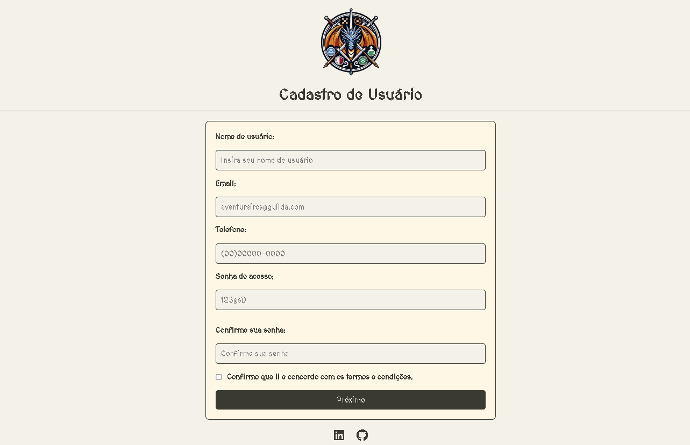
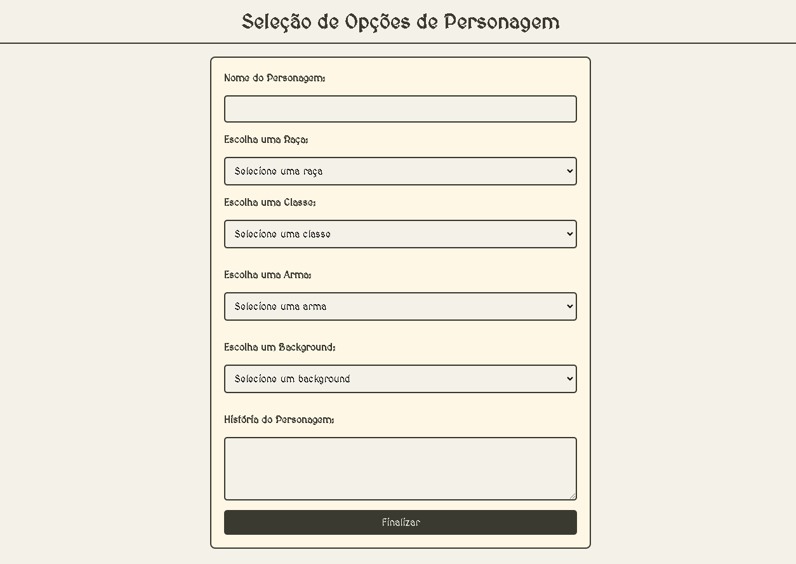
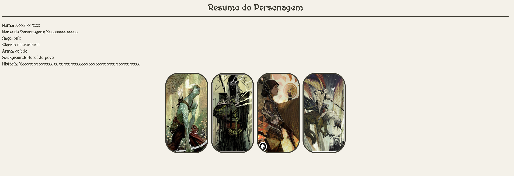

# Formulário HTML | CSS | JAVASCRIPT | Faculdade SENAC DF | Padrões Web

Status: Concluído!

## Sobre o Projeto

---

- Resultado do meu trabalho de Padrões Web 
- Criando um formulário de cadastro, decidi unir uma atividade de lazer, o RPG e criei uma página inicial para uma guilda genérica.


## Principais tecnologias utilizadas 

````
 HTML - CSS - JAVASCRIPT
````
## Funcionalidades
- Verificações de validações dos campos de dados
- Imagens das raças, classes, armas e backgrounds aparecem ao serem selecionadas as opções, juntamente com um pequeno resumo.


## Imagens Previa 

### ♦Página de cadastro do Usuário
<p align="center" >
     
</p>

### ♦ Página de criação de Personagem
<p align="center" >
     
</p>

### ♦ Página Final com as Escolhas
<p align="center" >
     
</p>


